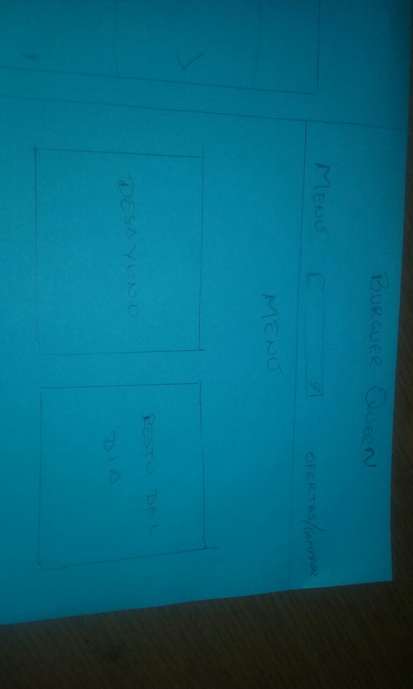

## componentes

# React | babel | webpack | configuración base para empezar un proyecto.

Aquí encontrarás la estructura y configuración básica para empezar un proyecto con react

* Ejecuta `npm install` para instalar las dependencias
* Ejecuta `npm run serve` para visualizar en el localhost
* Ejecuta `npm run production` para crear tu archivo app.js en public (recuerda que solo debes hacerlo al terminar tu proyecto para subirlo a producción)

